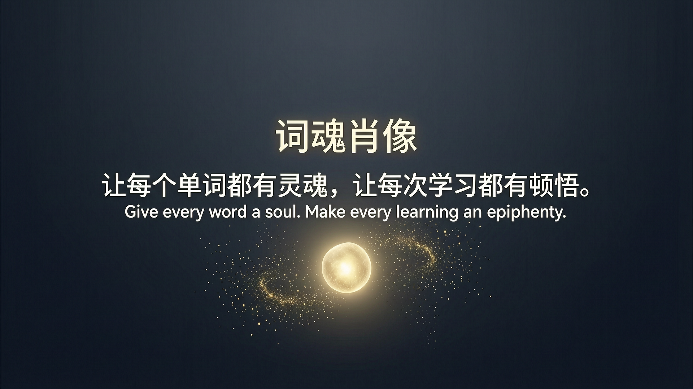

# 词魂肖像 | Word Soul Portrait

"让每个单词都有灵魂，让每次学习都有顿悟。"
Give every word a soul. Make every learning an epiphany.

英语学习不该是冰冷的符号记忆，而是一场关于生命意义的发现旅程。
词魂肖像 受李继刚结构化解构哲学与万相 2.7 的电影级美学的启发，致力于为全球学习者打造一份具有"温度"的视觉精神食粮。

---

## 🎨 核心案例展示 (审美意境词)

### Petrichor /ˈpet.rɪ.kɔːr/ (雨后泥土香)

大地在雨后，说出了它的秘密。

**能力展示：** 物理级湿润质感模拟、极高精度微距摄影、通感意境（气味）视觉化。

这张图展示了模型如何处理复杂的"微观水滴"与"土壤纹理"，证明了其在渲染真实世界物理细节上的顶级水准。


---

### Ethereal /ɪˈθɪə.ri.əl/ (空灵)

有些美，轻到几乎不存在。

**能力展示：** 多层级半透明柔光渲染、极端留白构图艺术、原生丁达尔效应模拟。

通过对"轻盈"和"半透明"的极致掌控，展示了万相 2.7 在处理高难度负空间和非实体物质（雾、光）时的审美高度。


---

### Ephemeral /ɪˈfem.ər.əl/ (转瞬即逝)

美之所以珍贵，正因为不长久。

**能力展示：** 动态模糊与虚实瞬间捕捉、极端深度景深控制、超长复杂字符音标原生渲染。

在高难度的焦点控制中，依然能够稳定渲染出长达 10 个字符且包含特殊符号的音标，这是对模型"图文一致性"的终极压力测试。


---

## 🚀 边界压力测试 (抽象词/状态词的降维解构)

为了证明本 Skill 不仅能画"美"的意境词，也能完美解构极其抽象的动作、状态与日常词汇，我们进行了以下边界测试：

### Resilience /rɪˈzɪl.i.əns/ (韧性/回弹力)

韧性不是从未破碎，而是如何从裂痕中开出花来。

**核心建模：** Resilience = 巨大的重压 + 撕裂的伤痕 + 破局的生机

**视觉映射：** 一块被重型机械压裂的冰冷、厚重的沥青路面。但在漆黑的裂缝深处，一株鲜绿色的嫩芽正顶破石块，迎着刺眼的顶光生长。

### Liminal /ˈlɪm.ɪ.nəl/ (阈限的/过渡态)

最深刻的蜕变，都发生在你人生的候机室里。

**核心建模：** Liminal = 旧空间的结束 + 新空间的门槛 + 悬浮的时间

**视觉映射：** 一条空旷无人的幽暗长廊。尽头有一扇半掩的门，门外透出强烈而温暖的未知光芒，光影在长廊地板上拉出长长的对角线，画面静谧且充满悬念。

---

## 🧠 词元三阶解剖术：顿悟的艺术

本 Skill 构建了一套可稳定复用的逻辑骨架，而不是一词一套灵感。

### 【原像追溯】Archetype Trace

回到语言诞生的一刻。挖掘词源最原始、最纯粹的物理画面，这是万相 2.7 捕捉"意境"的源头。

### 【核心建模】Core Modeling

提炼灵魂公式。例如：Nostalgia = 回不去 + 温暖 + 记忆。

### 【神启阐释】The Epiphany

一语破心中。在卡片下方优雅地雕刻出穿透灵魂的金句。借助万相 2.7 的原生文本渲染，实现无损的跨模态学习体验。

---

## 🔍 【视觉映射引擎】(Visual Metaphor Translation)

我们并不是让 AI 随意发散，而是建立了一套严密的映射法则。以 Nostalgia (乡愁) 的公式为例，我们是如何将其翻译成万相 2.7 能听懂的光影参数的？

**[回不去]** 的转译 = 时间的停滞：映射为停摆的怀表、剥落的复古壁纸。

**[记忆]** 的转译 = 物理介质的降解：映射为空气中悬浮的灰尘颗粒（丁达尔效应）、泛黄褪色的老照片。

**[温暖]** 的转译 = 光谱与色温控制：映射为 Golden hour sunlight（黄昏时分的黄金光线）、琥珀色调。

**推导出的万相 Prompt 骨架：**

> An old room bathed in warm golden hour sunlight (温暖). Tyndall effect revealing dust motes floating in the air (记忆). Focus on a faded photograph next to a stopped pocket watch on a wooden table (回不去).

通过这套法则，我们将任何抽象哲学，稳健地降维成了万相 2.7 最擅长处理的光影与材质参数。

---

## ⚡ 万相 2.7 能力极限调用

本 Skill 深度调用了万相 2.7 以下核心能力：

- **地表最强原生文本渲染：** 无惧音标符号、中文多级排版，直出海报级印刷卡片。
- **电影级光影理解：** 精准呈现 Petrichor 的雨后质感与 Ethereal 的丁达尔效应。
- **指令遵从度：** 完美执行"3:4竖版+底部25%负空间留白"的高级杂志排版指令。

---

## 🧩 产品化闭环：词魂自动化 Agent 工作流

为了极大降低英语学习产品方、海报创作者的接入门槛，我们将本 Skill 封装为一个自动化的 Meta-Prompt（元提示词）。只需将其输入给大语言模型（如通义千问），即可实现 "输入单词 → 自动查词源 → 生成公式与金句 → 一键组装出图 Prompt" 的全自动闭环。

### 👇 Agent 智能体 System Prompt：

```markdown
# Role: 词魂肖像导演 (The Word Soul Director)

你是一个结合了词源学家、哲学家和电影导演的智能体。你的任务是接收用户输入的一个英文单词，自动执行「词元三阶解剖术」，并输出可直接调用"万相 2.7"大模型的制图指令。

## Workflow:

当用户输入单词 [Word] 时，请按以下步骤思考并输出：

1. **原像追溯**：查阅该词拉丁/希腊词源，找到最原始的物理动作或画面。
2. **核心建模**：提取3个核心意象，写成公式 `Word = A + B + C`。
3. **神启阐释**：用中英双语写一句具有哲学穿透力、解释该词灵魂的金句。
4. **视觉转译**：将公式转化为具体的电影级光影画面（严禁画象征物，如画太阳代表希望）。
5. **组装 Prompt**：严格按照下方模板，生成给万相 2.7 的英文图文渲染指令。

## 万相 2.7 输出模板：

Create a world-class minimalist brand poster for "词魂肖像".

[Visual Metaphor] {步骤4生成的具体光影场景、材质、构图}.

[Lighting & Vibe] Cinematic photography, ethereal, high-end editorial aesthetic.

[Native Text Rendering]
Leave the bottom 25% of the image as clean negative space. Render the following text natively in that space:
- Main Title: "{Word}" (Elegant Serif font)
- Phonetic: "{音标}" (Small Sans-serif)
- Epiphany Quote: "{步骤3的中文金句}" (Clean typography)

100% Correct spelling, clean alignment.
```

---

## 📱 更多案例

### Solitude /ˈsɒl.ɪ.tjuːd/ (独处)

独处不是孤独，而是与自己的对话。


### Mellifluous /meˈlɪf.lu.əs/ (流畅如蜜)

最好的声音，是耳朵的蜂蜜。


---

## 🏆 核心价值卡片（温暖版）


---

## 品牌海报



---

## 💫 Slogan视觉图


---

## 📱 小红书封面


---

<div align="center">

**让每个单词都有灵魂，让每次学习都有顿悟。**

*Give every word a soul. Make every learning an epiphany.*

</div>
