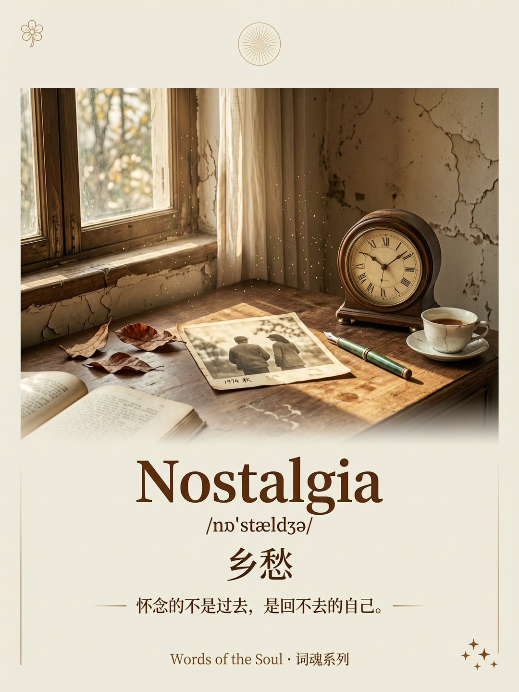

# 词魂肖像 | Word Soul Portrait

<div align="center">

**给英文单词一张脸**

*Not a symbol. A soul made visible.*

[](https://github.com/your-username/word-soul-portrait)
[](https://tongyi.aliyun.com/wanxiang)
[](LICENSE)

</div>

---

## 这是什么

词魂肖像是一个AI技能，用于为英文单词生成"灵魂肖像"——不是画个象征物（"hope"画个太阳），而是生成一张能传达这个词"灵魂"的视觉卡片。

**输入：** 一个英文单词（如 Solitude, Ethereal, Nostalgia）

**输出：** 
- 深度语义解析（三刀法解剖）
- 一语道破的金句
- 1080x1440 视觉肖像卡片（带文字）

---

## 核心方法：三刀法

### 第一刀：原始画面
追溯词源最物理的画面

### 第二刀：核心意象公式
提炼核心元素，写成公式

### 第三刀：灵魂解释
充满洞见的深层含义阐述

---

## 案例展示

### Solitude /ˈsɒlɪtjuːd/ 独处

**核心意象：** `Solitude = 自己 + 宁静 + 自由 → 独处`

**一语道破：** 
> "Solitude is not loneliness, but a conversation with yourself."
> "独处不是孤独，而是与自己的对话。"


---

### Ethereal /ɪˈθɪəriəl/ 空灵

**核心意象：** `Ethereal = 轻盈 + 超凡 + 不真实 → 空灵`

**一语道破：**
> "Some beauty is so light, it almost doesn't exist."
> "有些美，轻到几乎不存在。"


---

### Nostalgia /nɒˈstældʒə/ 乡愁

**核心意象：** `Nostalgia = 回不去 + 记忆 + 温暖 → 乡愁`

**一语道破：**
> "We miss not the past, but the self we can no longer be."
> "怀念的不是过去，是回不去的自己。"



---

### Petrichor /ˈpetrɪkɔːr/ 雨后泥土香

**核心意象：** `Petrichor = 雨 + 泥土 + 秘密 → 雨后泥土香`

**一语道破：**
> "After the rain, the earth finally speaks."
> "大地在雨后，说出了它的秘密。"


---

## 技术实现

**图像生成：** 万相2.7（Wan2.7）图像生成模型

**Prompt结构：**
```
词魂肖像：{Word}

【灵魂定义】
{核心意象公式}

【视觉场景】
{场景描述}
{光影设计}
{氛围描述}

【画面文字排版】
- 主标题："{Word}"
- 音标："{音标}"
- 中文："{中文翻译}"
- 金句："{中文金句}"

【风格】
- 电影感摄影
- 极简，有呼吸感
- 文字清晰可读

【尺寸】
- 1080x1440（3:4竖版）
```

---

## 设计哲学

本技能的设计方法论，深受 **ljg系列技能** 启发：

- **ljg-concept-portrait** - 概念肖像师，为抽象概念"捏脸"
- **ljg-word** - 单词深度解剖，输出顿悟

ljg的核心哲学是：**不解释，让概念显形**。

词魂肖像把这个哲学应用到英文单词学习场景，让每个单词都有灵魂，让每次学习都有顿悟。

---

## 红线原则

1. **不是翻译** - 目标是深层含义，不是中文翻译
2. **不是象征物** - 不画太阳代表hope，画灵魂的视觉
3. **有哲学高度** - 一语道破必须让人"哦"一声
4. **极简，有呼吸感** - 不堆砌，留白
5. **电影感，不是插画感** - 真实感，有故事感
6. **文字融入画面** - 形成完整的学习卡片

---

## 使用方式

### 在 DuMate/OpenClaw 中使用

```
/word-soul-portrait Solitude
```

### 直接调用脚本

```bash
export DASHSCOPE_API_KEY="your-api-key"
export DASHSCOPE_BASE_URL="https://dashscope.aliyuncs.com/api/v1/"

python3 scripts/image-generation-editing.py \
    --user_requirement "词魂肖像：Solitude..." \
    --n 1 \
    --size "1080*1440"
```

---

## 文件结构

```
word-soul-portrait/
├── SKILL.md                    # Skill主文件
├── README.md                   # 本文件
├── examples/                   # 案例图片
│   ├── solitude_独处.png
│   ├── ethereal_空灵.png
│   ├── nostalgia_乡愁.png
│   └── petrichor_雨后泥土香.png
├── scripts/                    # 生成脚本
│   ├── image-generation-editing.py
│   ├── file_to_oss.py
│   ├── parse_resolution.py
│   └── check_wan_task_status.py
└── references/                 # 参考文档
    ├── common.md
    └── image-generation-editing.md
```

---

## 关于作者

**硅蜜** - AI技能开发者

联系方式：18157134636

---

## 致谢

- [ljg系列技能](https://github.com/ljg-skills) - 设计方法论启发
- [万相2.7](https://tongyi.aliyun.com/wanxiang) - 图像生成模型
- [DuMate](https://github.com/dumate) - AI助手平台

---

<div align="center">

**让每个单词都有灵魂，让每次学习都有顿悟。**

*Give every word a soul. Make every learning an epiphany.*

</div>
