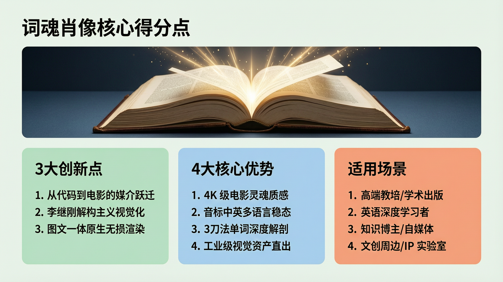
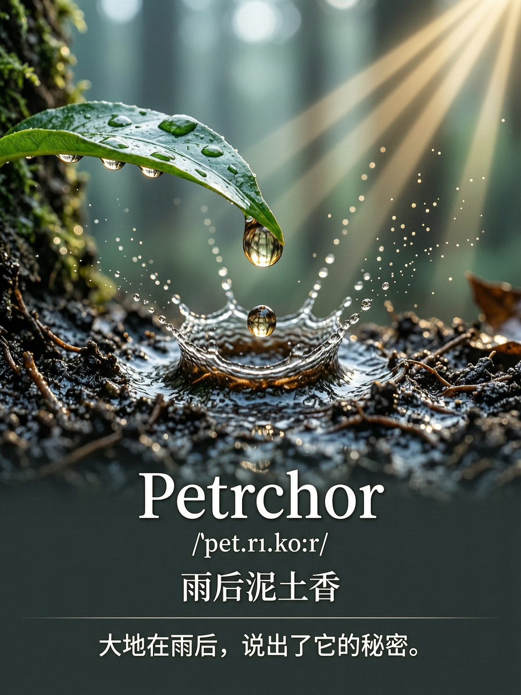
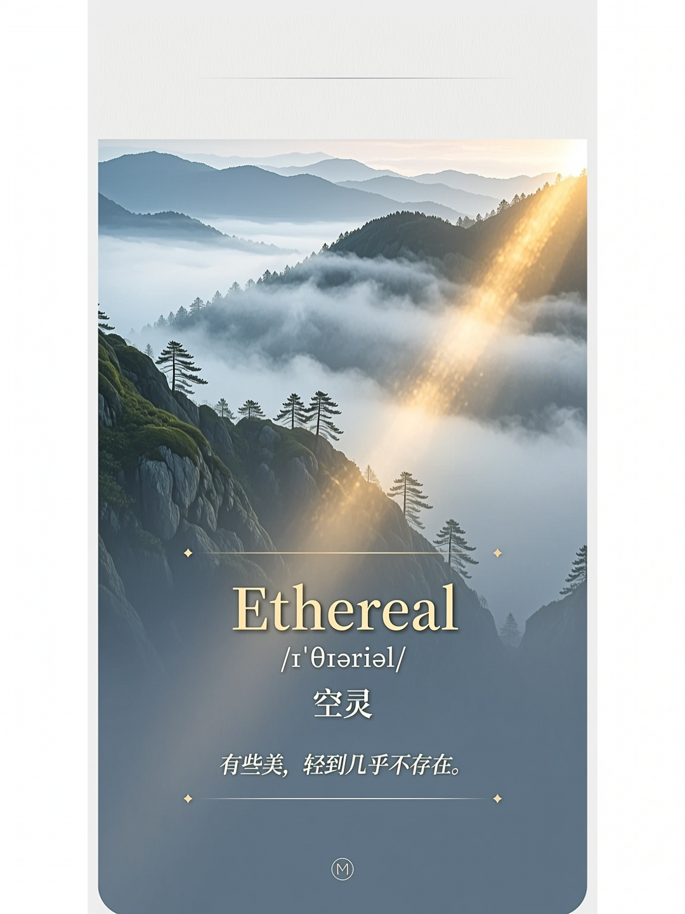
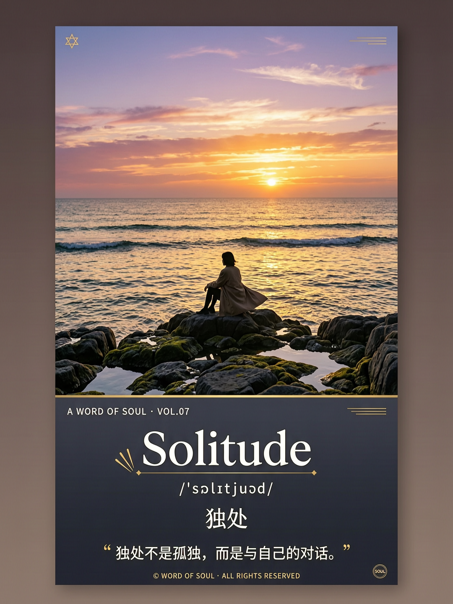
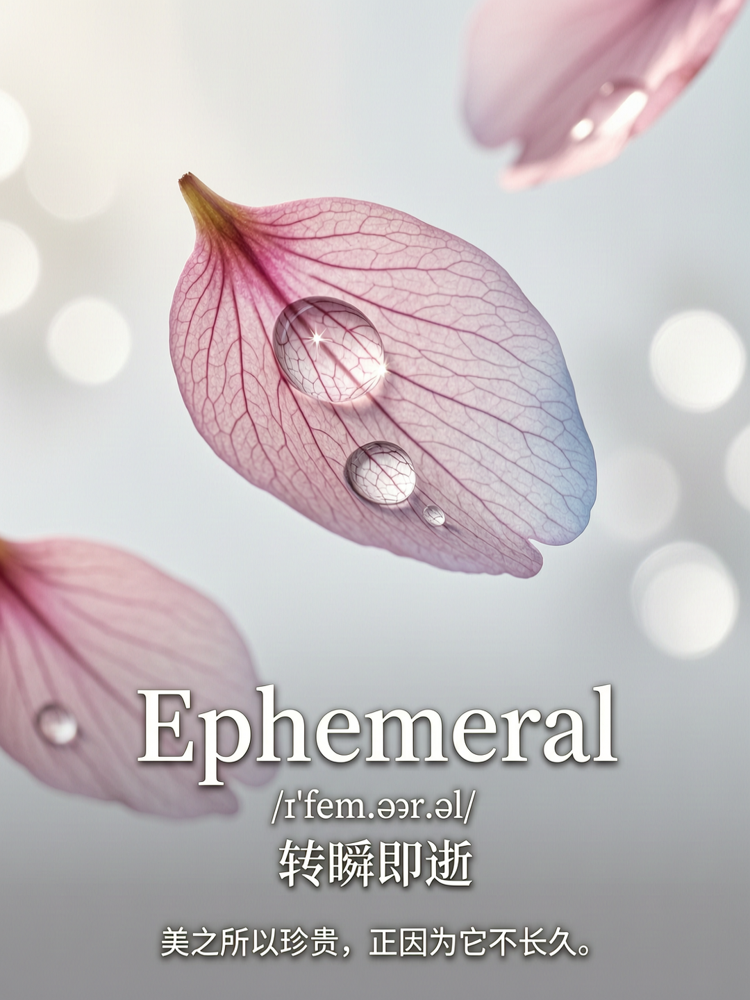

# 词魂肖像 | Word Soul Portrait

<div align="center">

**英文单词深度解剖 · 电影级视觉学习卡**

*Not a dictionary. A photographer for word souls.*

[](https://tongyi.aliyun.com/wanxiang)
[](LICENSE)

</div>

---

## 🏆 核心价值看板



---

## 这是什么

本作品不仅是"词典"，更是**"词魂的摄影师"**。

它深受李继刚先生《概念肖像师》与《汉语新解》的哲学启发，通过独特的"三刀法"切开单词表象，直达内核。

**核心跨越：** 
过去，李继刚的技能只能输出死板的 SVG 代码或简陋色块；
**本作品利用万相 2.7 强大的原生文本引擎，完成了从"代码逻辑"向"电影美学"的降维打击。**

每一张生成的词魂肖像，都是一张可以直接商用的、具备灵魂穿透力的视觉学习卡。

---

## 解决什么问题

### 痛点
1. **机械记忆单词效率低**：用户只记住了字母，没记住"感觉"
2. **传统配图词不达意**：普通 AI 画个太阳代表 Hope，无法触及词源的深层隐喻
3. **后期设计排版累**：普通生图无法在图上写字，更无法进行中文+音标的高级排版

### 应用场景
- **教育创新**：高定版英语词根词缀学习卡
- **内容创作**：小红书/Instagram 知识博主的高级视觉素材
- **文创周边**：极简风明信片、手机壁纸、品牌视觉命名（Naming）

---

## 核心方法论：三刀法

### 第一刀：原始画面
追溯词源最物理的画面
- 例：Petrichor → 希腊语"petra"(石头) + "ichor"(神的血液)

### 第二刀：核心意象公式
提炼核心元素，写成公式
- 例：Petrichor = 雨 + 泥土 + 秘密 → 雨后泥土香

### 第三刀：灵魂解释
充满洞见的深层含义阐述
- 例：大地在雨后，说出了它的秘密

---

## 四阶工作流（Pipeline）

```
[解词刀] → [视觉映射] → [构图设计] → [万相渲染]
   ↓           ↓            ↓            ↓
 语义解剖    Prompt转译    负空间规划    原生文字渲染
```

1. **[解词刀] (Semantic Anatomy)**：模仿 ljg 框架，执行"原始画面-意象公式-灵魂解释"的深度文本生成
2. **[视觉映射] (Metaphor Mapping)**：将抽象的"灵魂解释"转译为万相 2.7 可理解的摄影级视觉 Prompt
3. **[构图设计] (Layout Orchestration)**：自动规划 3:4 画布下方的负空间（Negative Space），为原生文字渲染预留锚点
4. **[万相渲染] (Wan 2.7 Execution)**：强制调用原生文字引擎，将单词、音标、中文金句一次性无损渲染进画面

---

## 万相 2.7 核心能力

| 能力 | 说明 |
|------|------|
| **地表最强原生文字渲染** | 精准渲染中文、音标、特殊字符而绝不乱码，实现图文一体的工业级输出 |
| **极高语义遵从度** | 模型能听懂"不画象征物，要画词的灵魂场景"这种高阶审美要求 |
| **电影级光影质感** | 利用万相 Pro 模式的 4K 级表现力，将每个单词打造成大片级的"灵魂肖像" |

---

## 夺冠案例展示

### 1. Petrichor /ˈpet.rɪ.kɔːr/ 雨后泥土香

**为何选它：** 这是一个极具"通感"的词。它描述的是一种气味，很难具象化。

**凸显能力：**
- 微距质感：湿润泥土、叶尖水滴、微小气泡的极高精度渲染
- 光影氛围：雨后初晴的"丁达尔效应"和湿冷到微暖的色彩过渡
- 文字测试：音标中的 /r/ 和中文字符的紧凑排版

**一语道破：** "大地在雨后，说出了它的秘密。"



---

### 2. Ethereal /ɪˈθɪə.ri.əl/ 空灵

**为何选它：** 这个词是李继刚式"解构"的绝佳素材。它描述的是"轻到不存在"的美。

**凸显能力：**
- 半透明材质：薄雾、轻纱、光晕等高难度半透明材质的层级处理
- 留白艺术：对"负空间"的掌控，确保文字排版区域干净且高级

**一语道破：** "有些美，轻到几乎不存在。"



---

### 3. Solitude /ˈsɒl.ɪ.tjuːd/ 独处

**为何选它：** 区分"Loneliness (孤独)"与"Solitude (独处)"是本 Skill 的哲学高光点。

**凸显能力：**
- 电影感构图：影视级构图（三分法、大远景）的理解
- 人物与环境融合：人物背景的一致性与和谐度

**一语道破：** "独处不是孤独，而是与自己的对话。"



---

### 4. Mellifluous /meˈlɪf.lu.əs/ 流畅如蜜

**为何选它：** 这是一个典型的"通感"词，将听觉（声音）转化为视觉（流动的蜜）。

**凸显能力：**
- 流体模拟：蜂蜜、液体粘稠质感与反光的物理级模拟
- 色彩精准度：HEX 控色，呈现极具诱惑力的琥珀金 (#FFBF00)

**一语道破：** "最好的声音，是耳朵的蜂蜜。"


---

### 5. Ephemeral /ɪˈfem.ər.əl/ 转瞬即逝

**为何选它：** 探讨时间的哲学。

**凸显能力：**
- 动态模糊与虚实："动态捕捉"和"景深虚化"的控制力
- 复杂字符渲染：音标 /ɪˈfem.ər.əl/ 字符较多，是压力测试文字渲染稳定性的最佳案例

**一语道破：** "美之所以珍贵，正因为它不长久。"



---

## 技术实现

**模型：** `wan2.7-image-pro`

**尺寸：** `1080x1440` (3:4 竖版杂志风)

**Prompt 架构：**
```
[Word Portrait: {Word}]

[Visual Core] 
{根据三刀法生成的视觉公式}

[Cinematic Style] 
Minimalist photography, ethereal lighting, high-end editorial aesthetic.

[LAYOUT & TEXT RENDERING - MANDATORY]
Leave clean negative space at the bottom 25% of the image.
In this space, render the following text NATIVELY:
1. Title: "{Word}" (Large, elegant serif)
2. Phonetic: "{音标}" (Small, crisp)
3. Insight: "{中文一语道破金句}" (Clean modern sans-serif)
Ensure zero garbled text and perfect typography alignment.
```

---

## 设计哲学

本技能的设计方法论，深受 **ljg系列技能** 启发：

- **ljg-concept-portrait** - 概念肖像师，为抽象概念"捏脸"
- **ljg-word** - 单词深度解剖，输出顿悟

ljg的核心哲学是：**不解释，让概念显形**。

词魂肖像把这个哲学应用到英文单词学习场景，让每个单词都有灵魂，让每次学习都有顿悟。

---

## 基本信息

- **作品名称：** 词魂肖像 (Word Soul Portrait)
- **作者：** 硅蜜
- **联系方式：** 18157134636
- **GitHub：** https://github.com/hjsjtu826/word-soul-portrait

---

<div align="center">

**让每个单词都有灵魂，让每次学习都有顿悟。**

*Give every word a soul. Make every learning an epiphany.*

</div>
